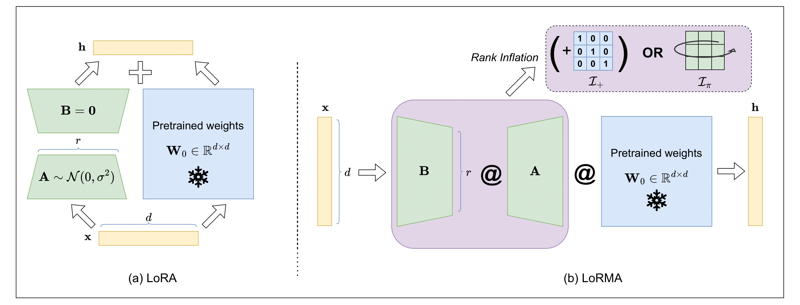

# LoRMA

## Introduction

Large Language Models have emerged to show remarkable capabilities in the NLP domain. Their effectiveness can mainly be attributed to their ability to adapt to an array of downstream tasks. However, generally, full fine-tuning is a computationally expensive job. To mitigate this, many techniques have been developed that prime efficiency, a prominent one being Low-Rank Adaptation (LoRA). However, LoRA and its variants employ re-parametrized additive updates. This repository contains the code for Low Rank Multiplicative Adaptation (LoRMA), which shifts the paradigm of additive updates to a much richer space of matrix multiplicative transformations. We tackle challenges such as computational complexity and rank inhibition by strategically ordering matrix operations and introducing rank inflation strategies.



The figure illustrates the contrast of the technique proposed with LoRA.

## Set up environment

```
conda create env -f environment.yaml
```

## NLU

In the `NLU/scripts/` folder various scripts for individual tasks and methods has been provided. Within each script is a placeholder for `num_gpus` (to be exported as environment variable). Also there are placeholders for rank $r$, seed, the scaling factor $\alpha$, mode (*pre* or *post*) amongst others. After refurbishing the parameters within these files, run them to initiate the process. For instance,

```
./roberta_large_plus_cola.sh pre 8 True 42
```

This code was laregly inspired by the way [LoRA](https://github.com/microsoft/LoRA/tree/main/examples/NLU)'s NLU implementation.

## NLG

### Language Generation

This is heavily inspired by [LoRA](https://github.com/microsoft/LoRA/)'s NLG implementation. We refurbish the code for our $`\text{LoRMA}_\pi`$ and $`\text{LoRMA}_+`$. To reproduce the results follow the instruction.

```
cd NLG
git clone https://github.com/microsoft/LoRA.git; cd LoRA
pip install -r requirement.txt
bash download_pretrained_checkpoints.sh
bash create_datasets.sh
cd ./eval
bash download_evalscript.sh
cd ..
```

#### To run E2E on $\text{LoRMA}$

**Training**

```
python -m torch.distributed.launch --nproc_per_node=1 src/gpt2_ft_lorma_plus.py \
    --train_data ./data/e2e/train.jsonl \
    --valid_data ./data/e2e/valid.jsonl \
    --train_batch_size 8 \
    --grad_acc 1 \
    --valid_batch_size 4 \
    --seq_len 512 \
    --model_card gpt2.md \
    --init_checkpoint ./pretrained_checkpoints/gpt2-medium-pytorch_model.bin \
    --platform local \
    --clip 0.0 \
    --lr 0.0002 \
    --weight_decay 0.01 \
    --correct_bias \
    --adam_beta2 0.999 \
    --scheduler linear \
    --warmup_step 500 \
    --max_epoch 5 \
    --save_interval 1000 \
    --lora_dim 4 \
    --lora_alpha 32 \
    --lora_dropout 0.1 \
    --label_smooth 0.1 \
    --work_dir ./trained_models/GPT2_M_lorma_plus/e2e \
    --random_seed 110
```

**Inference**

```
python -m torch.distributed.launch --nproc_per_node=1 src/gpt2_beam_lorma_plus.py \
    --data ./data/e2e/test.jsonl \
    --batch_size 1 \
    --seq_len 512 \
    --eval_len 64 \
    --model_card gpt2.md \
    --init_checkpoint ./trained_models/GPT2_M_lorma_plus/e2e/model.26290.pt \
    --platform local \
    --lora_dim 4 \
    --lora_alpha 32 \
    --beam 10 \
    --length_penalty 0.8 \
    --no_repeat_ngram_size 4 \
    --repetition_penalty 1.0 \
    --eos_token_id 628 \
    --work_dir ./trained_models/GPT2_M_lorma_plus/e2e \
    --output_file predict.26290.b10p08r4.jsonl
```

**Decoding**

```
python src/gpt2_decode.py \
    --vocab ./vocab \
    --sample_file ./trained_models/GPT2_M_lorma_plus/e2e/predict.26289.b10p08r4.jsonl \
    --input_file ./data/e2e/test_formatted.jsonl \
    --output_ref_file e2e_ref.txt \
    --output_pred_file e2e_pred.txt
```

**Evaluation**

```python eval/e2e/measure_scores.py e2e_ref.txt e2e_pred.txt -p```


#### To run WebNLG/DART of $\texttt{LoRMA}$

Follow the training and inference steps from E2E and replace with required WebNLG/DART paths.

**Decoding**

```
python src/gpt2_decode.py \
    --vocab ./vocab \
    --sample_file ./trained_models/GPT2_M_lorma_plus/webnlg/predict.20000.b10p08.jsonl \
    --input_file ./data/webnlg_challenge_2017/test_formatted.jsonl \
    --ref_type webnlg \
    --ref_num 6 \
    --output_ref_file eval/GenerationEval/data/references_webnlg \
    --output_pred_file eval/GenerationEval/data/hypothesis_webnlg \
    --tokenize --lower
```

**Evaluation**

```
cd ./eval/GenerationEval/
python eval.py \
    -R data/references_webnlg/reference \
    -H data/hypothesis_webnlg \
    -nr 6 \
    -m bleu,meteor,ter 
cd ../..
```

For DART change accordingly similar to WebNLG. 

### Mathematical Reasoning

To replicate results for mathematical reasoning, run the `run_math_lorma.sh` script in the `NLG/MetaMathQA` directory. For instance,

```
./run_math_lorma.sh 8 42 pre rri
```

Note that for running an instance of $`\text{LoRMA}_+`$ the last argument (which is `rank_inflation`) pass `rri` and for $`\text{LoRMA}_\pi`$ pass `shift`. To change the $\alpha$ parameter, make relevant changes in the bash script itself.

## License
[](https://creativecommons.org/licenses/by-nc/4.0/)
The codebase follows [CC-BY-NC](CC-BY-NC) license. Thus, users can share and adapt our codebase if they give credit to us and do not use our codebase for any commercial purposes.

